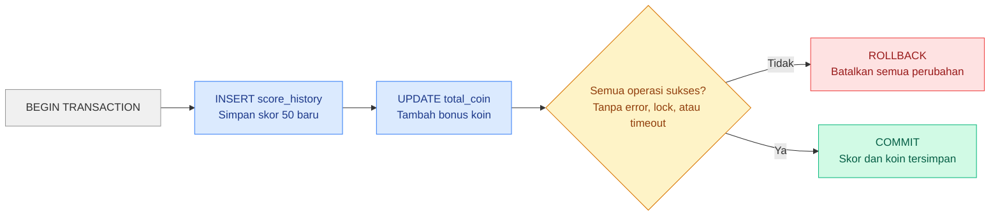

export const frontmatter = {
    slug: 'database-transaction',
    title: 'Database Transaction',
    description: 'Understanding the fundamentals of database transactions, the ACID properties, and transaction examples in SQL.',
    date: '2026-06-16',
    category: 'Database',
    readingTime: '5 min read',
};

## What is a Database Transaction

A **database transaction** is a set of operations—such as reading, inserting, updating, or deleting data—that are executed as a single unit of work.

Transactions follow the “all-or-nothing” principle: either **every operation is saved successfully**, or if even one operation fails, **all changes are automatically rolled back**.

When building applications that involve important data—like balance transfers, payments, ticket bookings, product purchases, or game scoring—you must ensure the whole process runs safely and consistently.

## Example Scenario

Imagine you’re playing a game. After completing a level, the system must do two things:

1. Save the new score to the history
2. Add bonus coins to the player’s total coins

Both actions **must succeed together**. If #1 succeeds but #2 fails (for example, the connection drops midway), you end up with a saved score history but no added coins—your data becomes inconsistent (it gets “stuck”).

A transaction is the database’s way of saying: “treat these steps as one package. If everything goes well, save it permanently (**COMMIT**). If anything fails, cancel everything as if it never happened (**ROLLBACK**).”



## ACID Concepts

- **Atomicity**: A transaction is a single unit. If any step fails, the entire transaction is canceled.
- **Consistency**: The database must remain in a valid state before and after the transaction.
- **Isolation**: Concurrent transactions don’t interfere with each other, as if they were executed sequentially.
- **Durability**: After a successful commit, changes are permanent even if the system crashes.

## Example in MySQL

Here is a minimal real example:

```sql
START TRANSACTION;

INSERT INTO score_history(player_id, score)
VALUES (1, 500);

UPDATE players
SET coins = coins + 50
WHERE id = 1;

COMMIT;
```

If an error occurs:

```sql
ROLLBACK;
```

## Example in Golang

**Start the transaction**

```go
tx, err := db.BeginTx(ctx, nil)
if err != nil {
	return err
}
```

- `db.BeginTx(ctx, nil)` creates a **new transaction**.
- Any query that must be part of the same “package” should be executed through `tx`, **not** `db`.
- If starting the transaction fails (for example, a DB connection issue), return the error immediately.

**Add an automatic rollback (safety net)**

```go
defer tx.Rollback()
```

- This means: if the function finishes before a commit happens (for example, it returns due to an error), roll back.
- So rollback will run automatically when the function exits **unless** `Commit()` has already succeeded.
- In many drivers, after a successful `Commit()`, calling `Rollback()` returns an error like “transaction has already been committed”—but this pattern is still safe and commonly used.

**First query: insert score history (part 1 of the package)**

```go
_, err = tx.ExecContext(
	ctx,
	"INSERT INTO score_history(player_id, score) VALUES (?, ?)",
	playerID,
	score,
)
if err != nil {
	return err
}
```

- `tx.ExecContext` executes the query inside the transaction.
- `?` are parameter placeholders (MySQL style). They are filled by `playerID` and `score`.
- If this insert fails, the function returns an error → `defer tx.Rollback()` runs → changes are reverted.

**Second query: update player coins (part 2 of the package)**

```go
_, err = tx.ExecContext(
	ctx,
	"UPDATE players SET coins = coins + ? WHERE id = ?",
	50,
	playerID,
)
if err != nil {
	return err
}
```

- Still using `tx.ExecContext` so this update is in the **same transaction** as the insert above.
- If this update fails, the function returns an error → rollback happens automatically.
- This is what keeps your data safe: you won’t end up in a situation where the score history is saved but the coins are not updated.

**Commit (make changes permanent)**

```go
return tx.Commit()
```

- `Commit()` marks the transaction as successful → all changes are saved permanently.
- If `Commit()` fails (for example, connection drops at the very end), the error is returned to the caller.